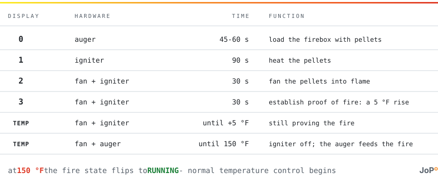

# The 0-1-2-3 startup cycle

What a Green Mountain Grill is doing while its panel counts 0-1-2-3, documented from
GMG's own operating manuals and from instrumented cold starts on real hardware.

When the grill lights, its panel counts 0-1-2-3 through a fixed-timer ignition sequence,
then becomes the temperature readout while the fire becomes fully established:

<picture>
  <source media="(prefers-color-scheme: dark)" srcset="startup-cycle-dark.svg">
  
</picture>

<details>
<summary>Plain-text version</summary>

```text
┌─────────┬───────────────┬──────────────┬─────────────────────────────────────────┐
│ display │ hardware      │ time         │ function                                │
├─────────┼───────────────┼──────────────┼─────────────────────────────────────────┤
│    0    │ auger         │ 45-60 s      │ load the firebox with pellets           │
│    1    │ igniter       │ 90 s         │ heat the pellets                        │
│    2    │ fan + igniter │ 30 s         │ fan the pellets into flame              │
│    3    │ fan + igniter │ 30 s         │ establish proof of fire: a 5 °F rise    │
│  temp   │ fan + igniter │ until +5 °F  │ still proving the fire                  │
│  temp   │ fan + auger   │ until 150 °F │ igniter off; the auger feeds the fire   │
└─────────┴───────────────┴──────────────┴─────────────────────────────────────────┘
  at 150 °F the fire state flips to RUNNING - normal temperature control begins
```

</details>

Stages 0-3 per [GMG's operating manuals](https://greenmountaingrills.com/manuals/); the
`temp` rows and the 150 °F ending are this project's own measurements.

## Beyond the count

Stage-0 auger time varies by model and ambient temperature (GMG's manuals give 45 s for
Jim Bowie and Daniel Boone, 55-60 s for other models). Stage 3's 30 seconds is how long
the *display* shows a 3 - the proof-of-fire wait itself continues under the temperature
readout, and took about 10 minutes on a measured cold start. A pit that never rises 5 °F
within 20 minutes shows `FAL` instead. The fire state changes to Running when the pit
reaches **150 °F**, no matter what target temperature is set.

## The fire state progress value

The grill reports a fire state - Startup, Running, Cool Down - and a progress value
beside it. The integration's `fire state progress` sensor exposes that value, byte 33 of
the grill's status reply - what GMG's own cloud API calls `fireStateProgress`. It steps
in four 25% increments through whatever state the grill is in: up through Startup,
hitting 100 at the exact moment the grill switches to Running (150 °F), then descending
through Cool Down as the fan winds the fire down.

**It is not the panel's 0-1-2-3 cycle.** On a measured cold start the panel finished its
count while this value sat at 50; it kept climbing for another 15 minutes while the fire
established. No one has established what each 25% step physically measures, so the steps
are deliberately left unlabeled. Other implementations label this byte as a
pellet-hopper level; it is not - a hopper does not fill during ignition and empty when
the fan stops.
